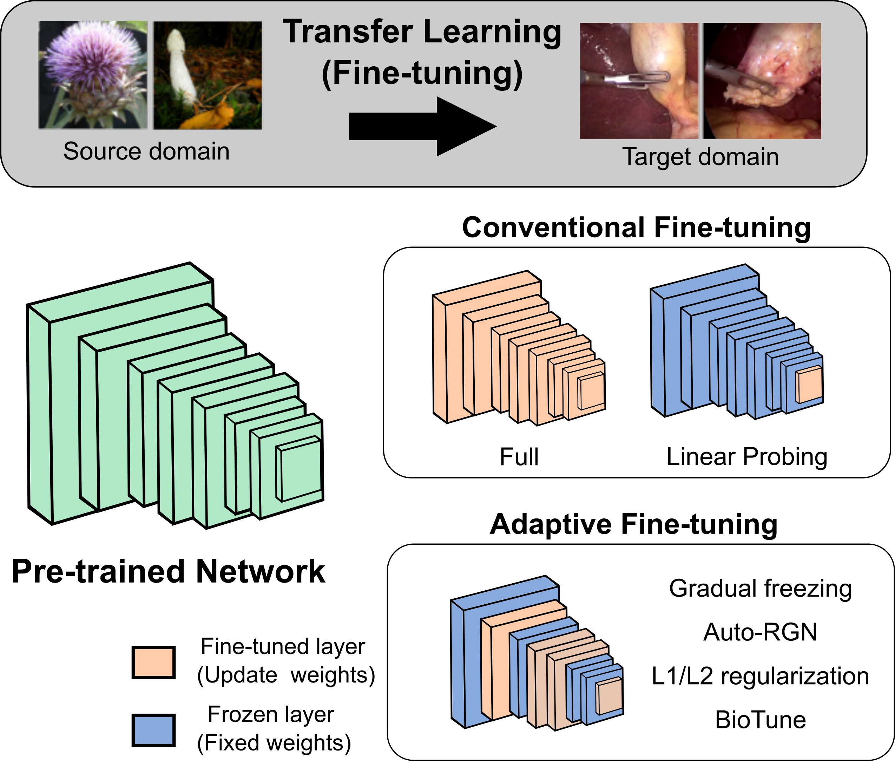
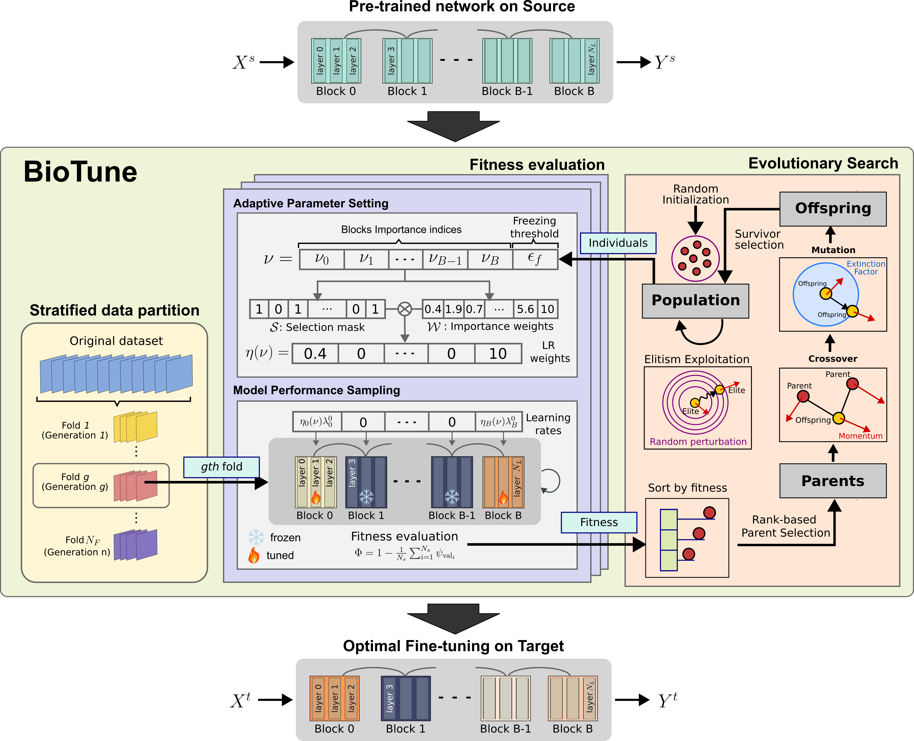
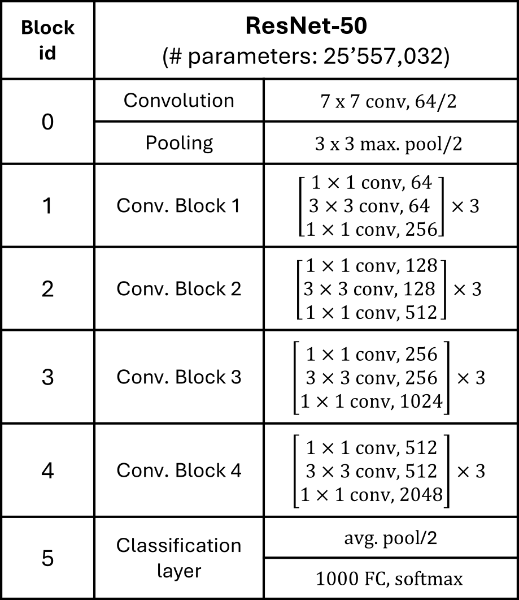

# BioTune: Bio-Inspired Fine-Tuning Optimization

[](https://www.python.org/downloads/)
[](https://pytorch.org/)
[](https://www.gnu.org/licenses/gpl-3.0)

BioTune is an evolutionary algorithm that automatically finds optimal fine-tuning strategies for transfer learning. It determines which layers to train and their learning rates.

**Paper:**
> Davila, A., Colan, J., & Hasegawa, Y. (2025). Bio-inspired fine-tuning for selective transfer learning in image classification. *IEEE Access*, vol. 13, pp. 129234-129249. doi: [10.1109/ACCESS.2025.3587524](https://doi.org/10.1109/ACCESS.2025.3587524)



---

## Table of Contents

- [Overview](#overview)
- [Installation](#installation)
- [Quick Start](#quick-start)
- [Usage Examples](#usage-examples)
- [How It Works](#how-it-works)
- [Results from Paper](#results-from-paper)
- [Configuration](#configuration)
- [Project Structure](#project-structure)
- [Citation](#citation)

---

## Overview

Traditional fine-tuning approaches:
- **Full fine-tuning**: Train all layers → risk of overfitting
- **Last layer only**: Train classifier → limited adaptation
- **Manual selection**: Choose layers by trial and error → time-consuming

**BioTune** uses evolutionary optimization to automatically:
1. Select which layers to train
2. Assign optimal learning rates per layer
3. Find configurations that generalize better



**Supported:**
- Networks: ResNet50, DenseNet121
- Datasets: Flowers102 (included), extensible to custom datasets

---

## Installation

### Prerequisites

- Python 3.9+
- CUDA GPU (8GB+ recommended)

### Setup

```bash
# 1. Create environment
conda create -n biotune python=3.9 -y
conda activate biotune

# 2. Install dependencies
cd BioTune
pip install -r requirements.txt

# 3. Verify installation
python test_installation.py
```

**Expected output:**
```
✓ All tests passed! BioTune is ready to use.
```

### Dataset Download

The Flowers102 dataset will be **automatically downloaded** on first run using PyTorch's built-in functionality. 

**Auto-download (Recommended):**
```bash
# Just run the code - dataset downloads automatically
python example/baseline_comparison.py
```

The dataset will be downloaded to `flowers/` directory with the following structure:
```
flowers/
└── flowers-102/
    ├── jpg/                  # 8189 images
    │   └── image_*.jpg
    ├── imagelabels.mat       # Class labels
    ├── setid.mat            # Train/val/test splits
    └── 102flowers.tgz       # Original archive
```

**Manual download (Optional):**

If auto-download fails, manually download from:
- **Source**: [Oxford Flowers102](http://www.robots.ox.ac.uk/~vgg/data/flowers/102/)
- **Files needed**: 
  - `102flowers.tgz` (images)
  - `imagelabels.mat` (labels)
  - `setid.mat` (splits)

Extract to `BioTune/flowers/flowers-102/` directory.

**Note**: First run may take 5-10 minutes to download (~350MB). You can also try other datasets included with Pytorch.

---

## Quick Start

### 1. Quick Test 

```bash
python example/baseline_comparison.py --n_generations 3 --population_size 3
```

⚠️ **Note**: Minimal parameters for testing only. Results will be suboptimal.

### 2. Recommended Configuration 

```bash
python example/baseline_comparison.py
```

**Default parameters:**
- Generations: 5 
- Population: 5 
- Elite: 2 
- Epochs: 30 per evaluation

**Output includes:**
- Comparison table with validation and test accuracies
- Selected layers
- **Per-layer learning rates for manual reproduction**

### 3. Full Paper Configuration 

```bash
python example/baseline_comparison.py \
    --n_generations 10 \
    --population_size 10 \
    --elite_size 3
```

---

## Usage Examples

### Basic Comparison

```bash
# Compare BioTune vs baselines
python example/baseline_comparison.py

# Output:
# ======================================================================
# COMPARISON SUMMARY
# ======================================================================
# Method               Val Acc         Test Acc        Time (s)       
# ----------------------------------------------------------------------
# ft_full              0.XXXX±0.XXXX  0.XXXX±0.XXXX  XXX.X±XX.X
# ft_final             0.XXXX±0.XXXX  0.XXXX±0.XXXX  XXX.X±XX.X
# BioTune              0.XXXX          0.XXXX±0.XXXX  XXXX.X
#   → Selected blocks: [0, 1, 2, 4, 5]
# ======================================================================
```

### Manual Reproduction

After running BioTune, use the outputted parameters:

```python
import torch
import torchvision.models as models

# 1. Load model
model = models.resnet50(weights='IMAGENET1K_V2')
model.fc = torch.nn.Linear(model.fc.in_features, num_classes)

# 2. Set per-layer learning rates (from BioTune output)
base_lr = 0.001
lr_ratios = {
    'conv1': 9.4894,   # Example values from optimization
    'bn1': 9.4894,
    'layer1': 7.6254,
    'layer2': 0.1929,
    'layer3': 0.0000,  # Frozen
    'layer4': 0.3471,
    'fc': 0.1594
}

param_groups = []
for name, params in model.named_parameters():
    block_name = name.split('.')[0]
    if block_name in lr_ratios:
        lr = base_lr * lr_ratios[block_name]
        param_groups.append({'params': params, 'lr': lr})
        params.requires_grad = (lr > 0)

# 3. Create optimizer
optimizer = torch.optim.Adam(param_groups)
scheduler = torch.optim.lr_scheduler.CosineAnnealingLR(optimizer, T_max=100)

# 4. Train normally with CrossEntropyLoss
```

### Command-Line Options

```bash
# Different network
python example/baseline_comparison.py --network densenet121

# More thorough search
python example/baseline_comparison.py \
    --n_generations 15 \
    --population_size 20

# Faster iteration (less training data)
python example/baseline_comparison.py \
    --train_split 0.25 \
    --n_epochs 20

# CPU only
python example/baseline_comparison.py --device cpu
```

### Programmatic Usage

```python
from src.optimization.biotuner import BioTuner, OptimizationConfig
from src.optimization.biotuner_problem import FineTuneProblem
import numpy as np

# Configure
config = OptimizationConfig(
    bounds=np.array([[0, 1]] * 7),  # 7 genes for ResNet50
    n_generations=10,
    population_size=10,
    elite_size=3,
    save_dir="results/my_experiment",
    device="cuda:0"
)

# Setup fitness function
fitness_params = {
    "method": "adaptive_block_normexp",
    "network": "resnet50",
    "lr": 0.001,
    "n_epochs": 30,
    # ... other parameters
}

problem = FineTuneProblem(params=fitness_params)
biotuner = BioTuner(
    config=config,
    fitness_function=problem.compute_fitness,
    update_params_function=problem.update_params,
    fitness_params=fitness_params
)

# Run
best_genes, best_fitness = biotuner.run()
print(f"Best accuracy: {1 - best_fitness:.4f}")
```

---

## How It Works

### Problem

Given a pre-trained model, find the best:
- **Layer selection**: Which layers to train/freeze
- **Learning rates**: Per-layer learning rate multipliers

### Solution: Evolutionary Algorithm



**1. Gene Encoding**

Each solution is encoded as genes `[g₀, g₁, ..., gₙ, threshold]`:

```python
# Example for ResNet50 (6 layers + 1 threshold)
genes = [0.85, 0.72, 0.45, 0.12, 0.68, 0.78, 0.40]
         ↓     ↓     ↓     ↓     ↓     ↓     ↓
       conv1  layer1 layer2 layer3 layer4  fc  threshold

# Layer selection: gene > threshold
selected = [✓, ✓, ✓, ✗, ✓, ✓]  # layer3 frozen (0.12 < 0.40)

# Learning rate scaling: 10^(2*(gene - 0.5))
lr_ratios = [9.49, 7.63, 0.19, 0.00, 0.35, 0.16]
```

**2. Evolutionary Process**

```
Initialize: Random population
For each generation:
  1. Evaluate: Train each configuration → validation accuracy
  2. Select: Keep top performers (elites)
  3. Exploit: Local search on elites
  4. Reproduce: Crossover + Mutation + Adoption
  5. Repeat until convergence
Final: Evaluate best on test set
```

**3. Evolutionary Operators**

- **Crossover**: Combine two parents → offspring
- **Mutation**: Random perturbations (adaptive based on fitness)
- **Adoption**: Learn from top performers
- **Exploitation**: Hill climbing on elite solutions

**Typical convergence:** 5-15 generations

---

## Results 

The paper evaluated BioTune on 9 datasets across different domains. Results shown are with full hyperparameters (10 generations, population 10, elite 3).

### Flowers102 Dataset

| Method | Test Accuracy | Parameters |
|--------|--------------|------------|
| **BioTune** | **91.68 ± 0.1%** | 99.12% |
| Full Fine-Tuning | 85.33 ± 0.5% | 100% |
| Linear Probing | 82.72 ± 0.6% | <1% |
| AutoRGN | 85.5 ± 0.3% | 100% |
| LoRA | 86.01 ± 0.2% | Variable |
| L¹-SP | 87.82 ± 0.5% | 100% |
| L²-SP | 85.29 ± 0.5% | 100% |

### Multi-Dataset Results

| Dataset | Domain | BioTune | Full FT | Improvement |
|---------|--------|---------|---------|-------------|
| Flowers-102 | Fine-grained | **91.68%** | 85.33% | +6.35% |
| FGVC-Aircraft | Fine-grained | **64.40%** | 58.68% | +5.72% |
| ISIC2020 | Medical | **82.90%** | 78.91% | +3.99% |
| DTD | Texture | **69.27%** | 68.03% | +1.24% |
| CIFAR-10 | Objects | **96.09%** | 95.65% | +0.44% |
| STL-10 | Objects | **97.50%** | 97.33% | +0.17% |
| MNIST | Digits | **99.13%** | 98.96% | +0.17% |
| USPS | Digits | **97.57%** | 97.05% | +0.52% |
| SVHN | Digits | 95.85% | **96.08%** | -0.23% |

**Key findings from paper:**
- Largest improvements on fine-grained classification tasks
- Consistent gains across most domains
- Parameter-efficient (often trains <100% of parameters)

⚠️ **Note**: Your results may vary due to:
- Hardware differences (GPU/CPU)
- Random seed variations
- Training data splits
- PyTorch/CUDA versions
- Hyperparameter choices (generations, population)

---

## Configuration

### Main Parameters

```python
# Evolution
n_generations = 10      # Paper uses 10 (5-15 typical)
population_size = 10    # Paper uses 10 (5-20 typical)
elite_size = 3          # Paper uses 3 (20-30% of population)

# Training
learning_rate = 0.001   # Base LR
n_epochs = 30           # Epochs per evaluation
patience = 3            # Early stopping
train_split = 0.5       # Use half of training data (faster)

# Model
network = "resnet50"    # or "densenet121"
num_classes = 102       # Dataset-dependent

# Robustness
seeds = [684, 559, 629] # Multiple seeds per evaluation
```

### Hyperparameter Guidelines

| Parameter | Small | Medium | Large | Paper |
|-----------|-------|--------|-------|-------|
| Population | 3-5 (quick test) | 10 (balanced) | 20 (thorough) | **10** |
| Generations | 2-5 (quick test) | 10 (balanced) | 15-20 (thorough) | **10** |
| Elite | 1-2 | 3 | 5-6 | **3** |

**Important**: Small values (pop=3, gen=2) are for quick testing only and will produce suboptimal results.

---

## Project Structure

```
BioTune/
├── src/
│   ├── models/                 # Model loading
│   │   └── model_utils.py      # load_pretrained_model, generate_model
│   ├── optimization/           # BioTune algorithm
│   │   ├── biotuner.py         # Evolutionary optimizer
│   │   └── biotuner_problem.py # Fitness evaluation
│   ├── training/               # Training utilities
│   │   ├── trainer.py          # ModelTrainer class
│   │   └── callbacks.py        # Early stopping
│   └── data/                   # Data loaders
│       └── flower102_dataloader.py
├── example/
│   ├── baseline_comparison.py  # Quick comparison
│   └── train_model.py          # Full experiment
├── figures/                    # Paper figures
│   ├── fig1.pdf                # Transfer learning overview
│   ├── fig2.pdf                # BioTune algorithm
│   └── fig3.pdf                # ResNet50 architecture
├── test_installation.py
├── requirements.txt
└── README.md
```

### Output Files

Results saved to `results/` directory:

**1. Generations Log** (`*_generations_TIMESTAMP.csv`)
- All individuals per generation
- Genes, fitness, selected blocks

**2. Summary Log** (`*_summary_TIMESTAMP.csv`)
- Best/average fitness per generation
- Population diversity
- Convergence tracking

**3. Training Log** (`exp_all_TIMESTAMP.csv`)
- Detailed training metrics
- Loss, accuracy per epoch

---

## Troubleshooting

### Import Error

**Problem:** `ModuleNotFoundError: No module named 'src'`

**Solution:** Run from BioTune root:
```bash
cd /path/to/BioTune
python example/baseline_comparison.py
```

### CUDA Out of Memory

**Solutions:**
```bash
# Option 1: Reduce batch size
# Edit src/data/flower102_dataloader.py: batch_size = 16

# Option 2: Smaller population
python example/baseline_comparison.py --population_size 3

# Option 3: Use CPU
python example/baseline_comparison.py --device cpu
```

### Dataset Download Fails

**Problem:** Auto-download fails or is too slow

**Solution:**

Manually download from [Oxford Flowers102](http://www.robots.ox.ac.uk/~vgg/data/flowers/102/):

1. Download files:
   - `102flowers.tgz` (~350MB)
   - `imagelabels.mat`
   - `setid.mat`

2. Create directory structure:
   ```bash
   mkdir -p flowers/flowers-102
   cd flowers/flowers-102
   ```

3. Extract images:
   ```bash
   tar -xzf 102flowers.tgz
   ```

4. Move label files to `flowers/flowers-102/`

**Expected structure:**
```
flowers/flowers-102/
├── jpg/
├── imagelabels.mat
└── setid.mat
```

---

## Citation

If you use BioTune in your research, please cite:

```bibtex
@ARTICLE{11075778,
  author={Davila, Ana and Colan, Jacinto and Hasegawa, Yasuhisa},
  journal={IEEE Access}, 
  title={Bio-Inspired Fine-Tuning for Selective Transfer Learning in Image Classification}, 
  year={2025},
  volume={13},
  number={},
  pages={129234-129249},
  keywords={Transfer learning;Adaptation models;Biomedical imaging;Training;Image classification;Tuning;Feature extraction;Data models;Computational modeling;Classification algorithms;Image classification;adaptive transfer learning;fine-tuning;evolutionary exploration;bio-inspired optimization;medical imaging},
  doi={10.1109/ACCESS.2025.3587524}}
```

**Paper link**: [https://doi.org/10.1109/ACCESS.2025.3587524](https://doi.org/10.1109/ACCESS.2025.3587524)

---

## License

GNU General Public License v3.0 (GPL-3.0)

See [LICENSE](LICENSE) for details.

---

## Contact

- **Email**: davila.ana@robo.mein.nagoya-u.ac.jp
- **Institution**: Nagoya University, Japan
- **Funding**: JST CREST (JPMJCR20D5), JSPS KAKENHI (25K21247)
